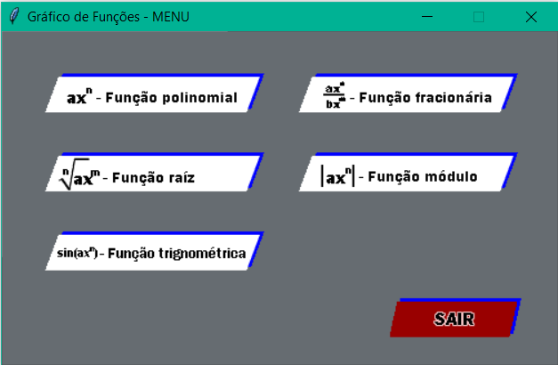
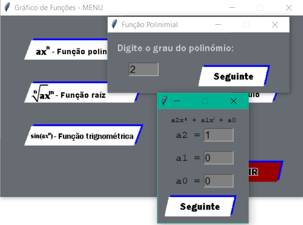
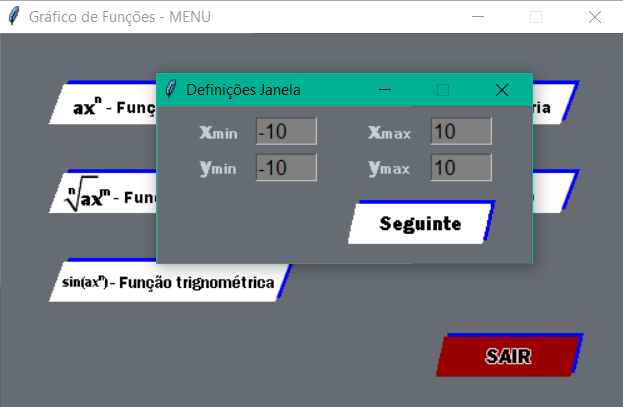
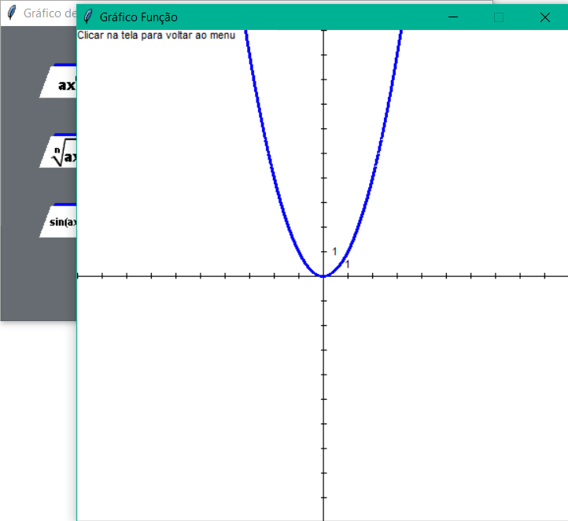
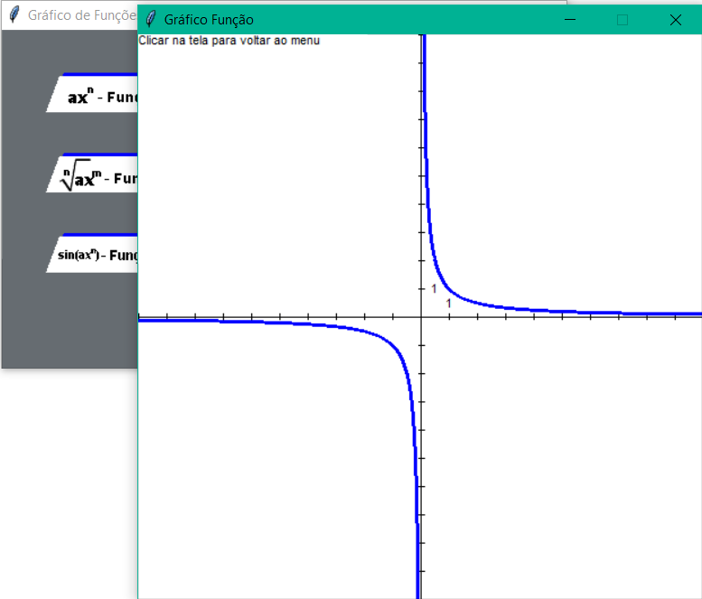
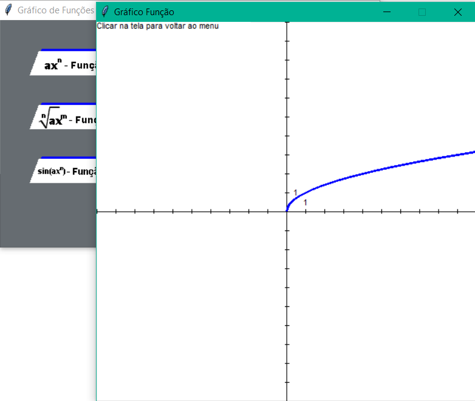
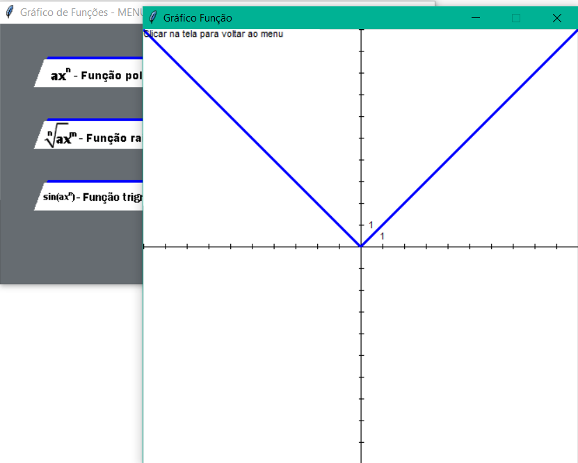
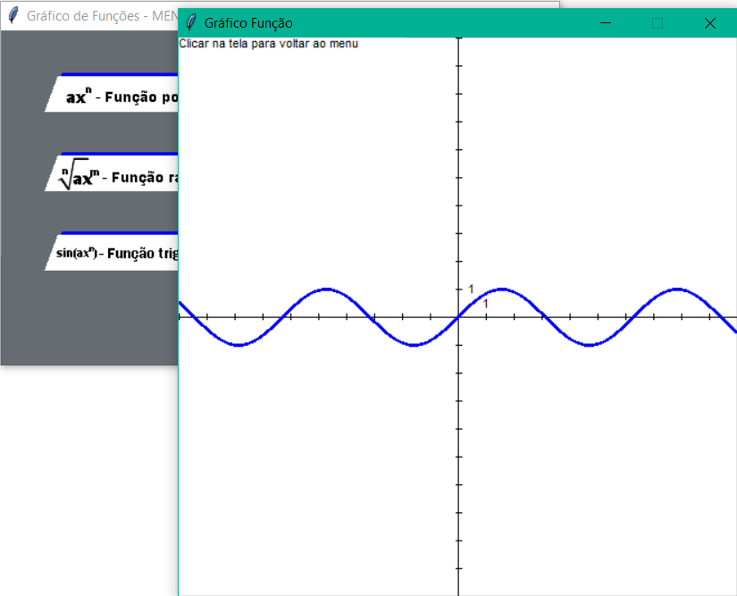

# Python Math Graphing GUI

> NOTE 1: This program was created when I was learning Python autonomously (2018), before knowing Git, Project structuring or Design/Code Patterns. There are obvious flaws in code quality.

Python program created to display graphs of function. Supported functions:
* Polynomial function
* Fractional function
* Absolute value function
* Nth root function
* Trigonometric function (sin,cos,tg)

After choosing the type of function, the user fill the options for that type.
It is also possible to choose the limit coordinates of the window.
The app is based on a very simple GUI library, [graphics.py](https://mcsp.wartburg.edu/zelle/python/graphics/graphics/index.html).

> NOTE 2: It was created in portuguese only

It is possible to run the app from executable in dist/graf_1-0/graf_1-0.exe, or from graf_0-7.py

## Home page

## Ploynomial function

## Fractional function

## Nth root function

## Absolute value function

## Trigonometric function

